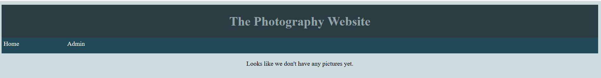
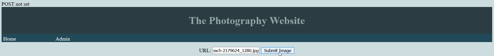
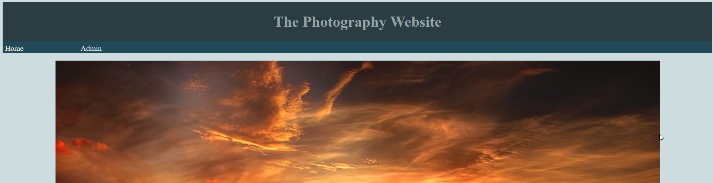

# Lab 4: Deploy the application management instance

Our web application will only allow configuration to be performed from a management instance that we create. We will restrict access to the management instance through the use of a security group. Other instances, which will be deployed in later labs, will only have read-access to the database. These instances will be unable to add any content to the website.

**Note:** As previously mentioned, this application is contrived and is only for the purpose of demonstrating various features of AWS. Don't design your application like this.

**Estimated time to complete:** 45 minutes

## Step 1: Launch a new instance

Perform the following from the EC2 console.

1. Launch an instance with the following attributes:
    * AMI: Amazon Linux
    * Instance size: t2.micro
2. Specify the following Instance Details:
    * Network: specify your lab VPC
    * Subnet: specify the public subnet
    * Auto-assign public IP: Use subnet setting (Enable) -
      * The subnet default should be set to "enable" because we configured auto assignment during the VPC lab
3. Leave the storage settings at their default values
4. Set the name to be something descriptive, like "App Master"
5. Configure a new security group with the following attributes:
    * Name: Application-Admin
    * Description: Provide something descriptive for the security group
    * Add rules to allow SSH and HTTP from only your IP address
4. Launching the instance will require you to generate an SSH key pair, or use an existing key pair. Explanations of key pairs are out of the scope of this lab. If you need some extra help with understanding SSH key pairs and their operation in AWS, please review the AWS documentation.

## Step 2: Configure server with necessary software

Now that we have an EC2 instance, we need to configure it to host our web application. We will eventually build an Amazon Machine Image (AMI) based on this configuration.

Connect to your instance over SSH and perform the following.

1. Become root: sudo su
2. Perform system updates: yum update -y
3. Install NTFS utilities: yum install -y ntfs-utils
    * This is probably already installed
4. Install web software: yum install -y httpd php php-mysql
5. Install mysql: yum install -y mysql
    * MySQL is used to remotely connect to the RDS instance and create a new table
6. Enable the EPEL repository: yum-config-manager --enable epel
    * This is necessary to install the stress tool
6. Install CPU stress testing tool: yum install -y stress
    * We will use stress to run CPU stress tests on the instances in our Auto Scaling Group (ASG)
7. Install Git
    * Git is needed for downloading the source code for our web app

## Step 3: Mount the EFS share

We need to mount the Elastic File System created during Lab 3. We must also configure the instance to automatically mount the EFS on boot.

Perform the following as the root user.

1. Create a directory for the mount: mkdir /mnt/efs
2. Mount the EFS: mount -t nfs4 -o nfsvers=4.1,rsize=1048576,wsize=1048576,hard,timeo=600,retrans=2 fs-xxxxxxxx.efs.us-east-1.amazonaws.com:/ /mnt/efs
    * Be sure to replace the hostname with the DNS name of your EFS
3. Add an entry to /etc/fstab to ensure that the EFS is automatically mounted on boot: fs-xxxxxxxx.efs.us-east-1.amazonaws.com:/ /mnt/efs nfs nfsvers=4.1,rsize=1048576,wsize=1048576,hard,timeo=600,retrans=2
    * Add the line above to the /etc/fstab file

## Step 4: Add a table to the RDS instance

Our web application uses MySQL as its backend database. Before the web app can use the previously configured RDS instance, a table must be added to the database.

Perform the following from your SSH session.

1. Log into your RDS instance: mysql -u <Master Username> -p -h <RDS Endpoint>
    * Enter your master password when prompted
2. Use the database that was already created during RDS provisioning: USE testapp;
3. Add a table for the web app: CREATE TABLE images (url TEXT);

## Step 5: Configure the webserver
Now that all of the backend infrastructure has been built and configured, we can begin to configure the actual webserver to host our application.

Perform the following as the root user.

1. Change directories to the EFS: cd /mnt/efs
3. Create a directory for the app code: mkdir /mnt/efs/testapp
4. Obtain a copy of the web app code
    * git clone https://github.com/acritelli/aws-labs.git
5. Move the web app code into your newly created directory
    * mv aws-labs/webApp/* testapp/
    * rm -rf aws-labs
6. Delete the default web directory: rm -rf /var/www/html
7. Change ownership of the app directory to the apache user: chown -R apache:apache /mnt/efs/testapp
8. Create a symbolic link for the web directory to the EFS: ln -s /mnt/efs/testapp /var/www/html
9. Move the configurationf file for the web application: mv /mnt/efs/testapp/
    * Our configuration file will be unique to our admin and public instances. Our admin instance will point to the writeable MySQL database, while our public instances will point to a Read Replica. By playing the configuration file outside of our EFS share, we can have a unique copy on each instance.
10. Modify the config.php file to reflect the RDS instance details that were created previously.
    * vim /var/www/config.php
11. Start the web server: service httpd start
12. Configure the web server to start on boot: chkconfig httpd on

## Step 6: Test the web app

The premise of our web application is a photography website. We use an administrative interface to add photos to the site, and they appear on the home page. Now that we have our instance deployed, we need to ensure that the web app is functioning properly.

Perform the following from a web browser.

1. Navigate to the public DNS name or IP address of your instance. You should see something like the screenshot below. Welcome to the world's worst web application!

2. Navigate to the "Admin" page of the web app.
    * The interface accepts URLs for photos that we wish to add to our page. The URL for these photos is stored in the database.
3. Find the link for a picture that you wish to upload. The link should be a direct link to the photo.
    * [Pixabay](https://pixabay.com/en/beach-north-sea-sea-sunset-water-2179624/) is a useful resource for finding photos that can be used.
4. Submit the URL to be added to the site.

5. Navigate to the home page of the site. You should now be able to see the image that was just added.

## Documentation

Document the information below about your environment. This documentation will be useful during later labs.

| Name     | Instance ID | IPv4 Public IP |
| :------- | :---------- | :------------- |
|          |             |                |

## Teardown Information

You will incur fees if you do not delete the EC2 instance created during this lab. The teardown process is below.

1. Terminate the EC2 instance from the EC2 console

## Questions

1. We manually performed all of the above configuration steps after our instance launched. How could this have been performed automatically during the instance provisioning process?

2. How would you obtain the public IP address of your instance while logged into the instance and without using the EC2 console?
    * Hint: This will involve making a web request to a specific URL

3. Explain the difference between user data and metadata.

4. Consider the following scenario: while working on your instance, you make a mistake and determine that terminating and recreating the instance is the best resolution. The instance has only been on for 5 minutes. How will you be charged?

5. Does rebooting your instance incur charge for a full hour? In other words, if you reboot a single instance, are you charged for two hours?
